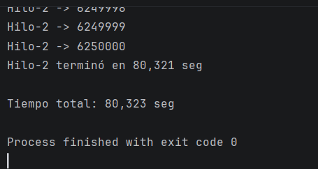
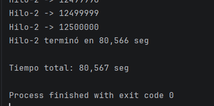
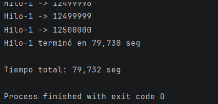
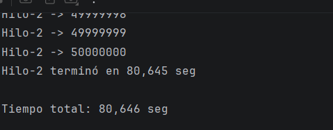
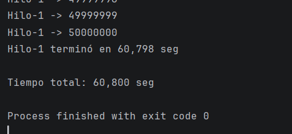
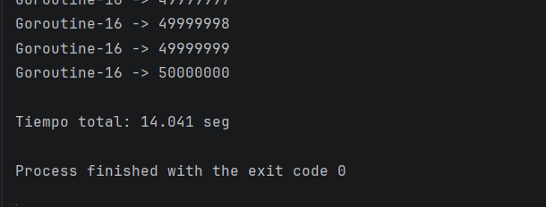
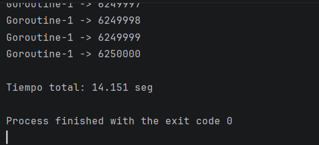
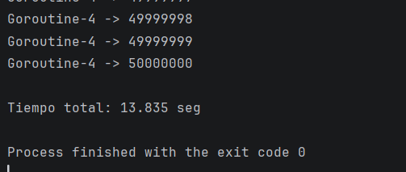
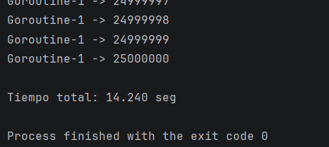
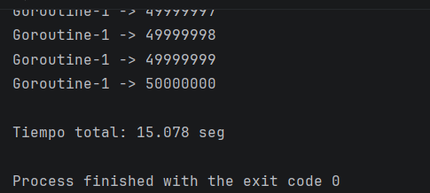

# Comparación de Concurrencia: Java vs Go

## Descripción

Este proyecto compara el rendimiento de **Java** y **Go** al ejecutar una tarea simple: contar del 1 al 50.000.000 e imprimir cada número. La idea es repartir ese trabajo entre varios hilos (en Java) o goroutines (en Go) y medir cuánto tiempo tarda cada configuración.

Se trabajaron los siguientes conceptos del curso:

- Concurrencia
- Hilos (Threads) en Java
- Goroutines en Go
- Memoria compartida
- Paso de mensajes
- Liveness (Deadlock, Starvation y Livelock)

---

## Objetivo

Ver si usar más hilos o goroutines hace que el programa termine más rápido, y comparar cómo se comportan Java y Go ante la misma carga de trabajo.

---

## Configuración de Pruebas

### Hardware

- Procesador:
- Núcleos:
- RAM:
- Sistema Operativo:

### Software

- Java:
- Go:

---

## ¿Cómo funciona cada programa?

### Java

El programa divide el rango 1 — 50.000.000 en partes iguales y le asigna cada parte a un hilo. Cada hilo imprime sus números usando `System.out.println` y al final reporta cuánto tardó.

### Go

El programa hace lo mismo: divide el rango y le asigna cada parte a una goroutine. La diferencia está en cómo se comunican los resultados — cada goroutine guarda sus números en memoria y al terminar los envía al programa principal a través de un **channel**. El programa principal es el único que escribe en pantalla.

---

## Resultados

### Java

| Hilos | Tiempo (s) |
| ----- |-----------:|
| 1     |     60.800 |
| 2     |     80.645 |
| 4     |     79.732 |
| 8     |     80.567 |
| 16    |     80.323 |

---
#### 16 hilos

#### 8 hilos

#### 4 hilos

#### 2 hilos

#### 1 hilo

---
### Go

| Goroutines | Tiempo (s) |
| ---------- |-----------:|
| 1          |     15.078 |
| 2          |     14.240 |
| 4          |     13.835 |
| 8          |     14.151 |
| 16         |     14.041 |

#### 16 hilos

#### 8 hilos

#### 4 hilos

#### 2 hilos

#### 1 hilo

---

## Comparación General

| Cantidad | Java (s) | Go (s) |
| -------- |---------:|-------:|
| 1        |   60.800 | 15.078 |
| 2        |   80.645 | 14.240 |
| 4        |   79.732 | 13.835 |
| 8        |   80.567 | 14.151 |
| 16       |   80.323 | 14.041 |

---

## Análisis

### Java

Lo primero que llama la atención es que con **1 solo hilo fue más rápido** que con 2, 4, 8 o 16. Esto parece contradictorio, pero tiene sentido cuando se entiende qué está pasando por dentro.

Cuando varios hilos intentan imprimir al mismo tiempo, Java no los deja hacerlo simultáneamente — solo uno puede imprimir a la vez y los demás tienen que esperar su turno. Entonces, en lugar de trabajar en paralelo, terminan haciendo fila. Con más hilos hay más espera y más trabajo extra para administrarlos, lo que explica por qué el tiempo aumenta en lugar de bajar.

### Go

Go fue mucho más rápido que Java en todas las configuraciones, y además sus tiempos fueron muy similares entre sí (entre 13.5 y 14.5 segundos sin importar cuántas goroutines se usaron).

Esto se debe a cómo está diseñada la implementación: cada goroutine trabaja sola sobre su parte del conteo, sin interrumpirse entre sí. Solo al final cada una envía su resultado por un channel y el programa principal lo imprime. Esto evita el problema de la "fila" que tiene Java.

---

## Relación con los Conceptos del Curso

### Concurrencia

En ambos programas el trabajo se divide en partes independientes que se ejecutan al mismo tiempo. Cada hilo o goroutine se encarga de un rango distinto de números, por lo que no dependen entre sí para contar.

### Memoria Compartida

En Java, cuando varios hilos quieren imprimir, compiten por el mismo recurso (la consola), lo que genera espera. En Go, las goroutines no comparten nada mientras trabajan — cada una tiene su propio espacio. Solo al final el programa principal recibe los resultados y los imprime.

### Paso de Mensajes

En Go se usó un **channel** para que cada goroutine le entregara su resultado al programa principal. Esto es lo que Go propone como buena práctica: en lugar de que todos compartan y compitan por un recurso, cada uno hace su trabajo y se lo pasa a quien lo necesita.

### Liveness

Durante todas las pruebas:

- No hubo **Deadlock**: todos los hilos y goroutines terminaron sin quedarse bloqueados esperando algo que nunca llegó.
- No hubo **Starvation**: todos procesaron su rango completo sin que ninguno fuera ignorado.
- No hubo **Livelock**: ningún hilo entró en un ciclo de reintentos sin avanzar.

---

---

## Conclusiones

Go fue entre 4 y 6 veces más rápido que Java en esta prueba. Además, mientras que Java empeoró al agregar más hilos, Go se mantuvo estable sin importar cuántas goroutines se usaran.

La razón principal no es que Go sea simplemente "más rápido" que Java, sino que la forma en que se diseñó la concurrencia es diferente. En Java los hilos compiten por imprimir, en Go las goroutines trabajan solas y se comunican al final. Esa diferencia de diseño es la que más impacta en los resultados.

